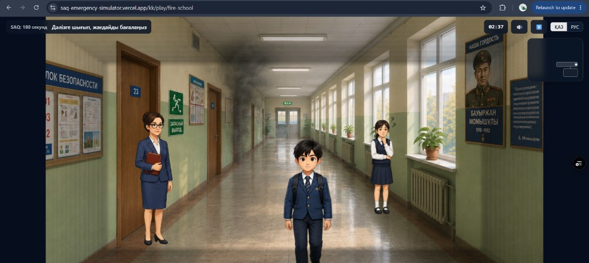

# SAQ: 180 секунд

Браузерный 2D-тренажёр для школьников по действиям при чрезвычайных ситуациях.
Первый сценарий — пожар в школе. Это настоящая игра, а не квиз: игрок свободно
управляет школьником, выбирает маршрут, взаимодействует с дверями и объектами
и видит последствия своих действий.

**Демо:** [saq-emergency-simulator.vercel.app](https://saq-emergency-simulator.vercel.app)



<p align="center"><em>Сценарий «Пожар в школе»: дым из кабинета, учитель, одноклассники и таймер 180 секунд. Интерфейс на қазақша / русском.</em></p>

## Запуск

```bash
npm install
npm run dev
```

Открыть:

- `http://localhost:3000/ru/play/fire-school` — сценарий «Пожар в школе»;
- `http://localhost:3000/kk/play/fire-school` — он же на казахском;
- `http://localhost:3000/ru/quest/earthquake` — квест «Землетрясение»;
- `http://localhost:3000/kk/quest/earthquake` — он же на казахском.

## Команды

| Команда | Что делает |
| --- | --- |
| `npm run dev` | dev-сервер |
| `npm run build` | production-сборка |
| `npm run start` | запуск production-сборки |
| `npm run lint` | ESLint |
| `npm run typecheck` | TypeScript strict-проверка |
| `npm run check:locales` | паритет ключей ru/kk локалей |
| `npm run verify` | всё вышеперечисленное разом |

## Управление

- **Desktop:** WASD / стрелки — движение, `E` / `Enter` — действие,
  `Escape` — пауза. Подсказка показывается один раз и исчезает.
- **Телефон:** только landscape (в портрете — экран «Поверните телефон»).
  Полупрозрачный джойстик слева, контекстная кнопка действия справа.

## Архитектура

```
src/
  app/[locale]/                # Next.js App Router, маршруты /ru и /kk
    page.tsx                   # стартовая страница
    play/fire-school/page.tsx  # страница игры
    quest/earthquake/page.tsx  # страница квеста «Землетрясение»
  components/game/
    PlayClient.tsx             # клиентская оболочка: device/orientation, сборка UI
    GameCanvas.tsx             # единственная точка создания/уничтожения Phaser.Game
    GameHud.tsx                # HUD: цель, таймер, пауза, язык, уведомления
    OrientationGuard.tsx       # заглушка портретного режима
    MobileControls.tsx         # джойстик + контекстная кнопка (multitouch)
  game/
    config.ts                  # Phaser-конфиг, палитра, createGame()
    EventBus.ts                # типизированная шина React ↔ Phaser (без импорта Phaser)
    scenario/schema.ts         # Zod-схема scenario.json
    scenes/                    # Boot → Preload → School (+ Debrief)
      schoolMap.ts             # greybox-геометрия этажа (данные, не логика)
    systems/
      InputController.ts       # клавиатура + виртуальный джойстик → вектор движения
      InteractionSystem.ts     # реестр интерактивных объектов, контекстное действие
      ScenarioEngine.ts        # data-driven триггеры/события/завершение из scenario.json
      TelemetrySystem.ts       # события прохождения (без персональных данных)
      TelemetryRepository.ts   # интерфейс хранилища; сейчас localStorage
  quest/
    schema.ts                  # Zod-схема quest.json (ровно 2 варианта, 1 верный)
    scoring.ts                 # подсчёт итога и разбор ошибок (чистые функции)
  components/quest/
    QuestClient.tsx            # прохождение: комната → разбор → следующая
    QuestScene.tsx             # кадр комнаты: тряска, точки выбора, таймер
    QuestBeat.tsx              # кадр последствия и титр перехода (+ реплика)
    RoomIcon.tsx               # линейные иконки комнат
  content/fire-school/         # scenario.json + локализованные тексты сценария
  content/earthquake/          # quest.json — 10 комнат квеста (только данные)
  messages/                    # ru.json / kk.json — словари интерфейса
  i18n/                        # next-intl: routing, request, navigation
```

### Ключевые решения

- **React ↔ Phaser только через EventBus.** HUD не импортирует состояние сцен,
  сцены не знают о React. Все события типизированы (`GameEventMap`).
- **Phaser только на клиенте.** `next/dynamic` c `ssr: false` + импорт Phaser
  внутри `useEffect`; на размонтировании `game.destroy(true)` — второй Canvas
  не появляется ни при hot reload, ни при навигации.
- **Data-driven сценарий.** `scenario.json` (валидируется Zod) описывает старт,
  trigger-зоны, события и условия завершения; `SchoolScene` лишь собирает
  системы. Новый сценарий = новый JSON, а не новая сцена.
- **Телеметрия за интерфейсом.** `TelemetryRepository` — контракт хранилища;
  замена localStorage на API не потребует трогать игровую сцену. Персональные
  данные не сохраняются.
- **Локализация без смешения языков.** Маршруты `/ru/...` и `/kk/...`,
  отдельные отредактированные словари, паритет ключей проверяется скриптом.

## Онлайн-квест «Землетрясение: правильная реакция»

Второй формат в том же приложении: `/{locale}/quest/earthquake`. Без Phaser и
свободного перемещения — 10 коротких ситуаций по схеме из ТЗ:

> описание ситуации → событие → вопрос → 2 варианта → правильно/неправильно
> + короткое объяснение → переход к следующей комнате.

Комнаты: квартира, лифт, школа/офис, торговый центр, улица, машина, ночь дома,
после толчков (газ), помощь другим, финальная эвакуация. Прохождение — 10–15
минут; в конце — счёт, уровень и разбор каждой ошибки с верным действием.

Квест идёт **во весь экран**: кадр занимает всё окно, интерфейс лежит поверх
него слоем (прогресс и комната сверху, событие, вопрос и разбор снизу).
Кнопка «На весь экран» дополнительно включает нативный полноэкранный режим.

Решение принимается **нажатием на место в кадре**, а не на строку текста:
комната — это фон, который трясёт, с двумя точками выбора (стол, колонна,
лестница, кнопки лифта). На решение даётся 12 секунд; не успел — комната
засчитывается как ошибка и показывается верное действие.

Внутри комнаты идёт хронология из четырёх тактов:

0. **Вступление** (если у комнаты есть клип) — персонаж входит в комнату:
   садится за парту и слышит гул, заходит в лифт и поворачивается к панели.
   Вопроса и таймера ещё нет, есть кнопка «Пропустить». Клип заканчивается
   ровно на кадре сцены, поэтому вопрос появляется без склейки.
1. **Сцена** — фон трясёт, идёт таймер, вы выбираете место.
2. **Последствие** — камера уходит туда, куда вы себя отправили: под стол,
   к панели лифта, в тёмный подъезд. Свой кадр у каждого варианта, поверх —
   разбор. В лифте на кадре звучит ответ диспетчера (ru/kk), субтитр виден
   всегда, звук — если браузер разрешил автозапуск.
   Клипы от первого лица сейчас подключены в комнате «Квартира» (вступление,
   верное действие, выход). Для остальных комнат клипы сняты, но отключены:
   они в прежней обстановке и не совпадают с современным артом — файлы лежат
   в `public/assets/quest/video/`. Такты без клипа показываются кадром
   с наездом камеры.
   Клип задаётся полем `video` (`intro.video`, `outcomes[...].video`,
   `bridge.video`); кадр `image` остаётся постером и запасным вариантом, если
   браузер не тянет H.264 или включён режим уменьшенной анимации — тогда
   вступление просто пропускается, а квест остаётся проходимым.
3. **Переход** — титр с кадром следующего места: «Через несколько часов. Вы
   возвращаетесь домой и заходите в лифт». У последней комнаты его нет.

- Комнаты — данные: `src/content/earthquake/quest.json`, валидируется Zod
  (`src/quest/schema.ts`): ровно два варианта, ровно один верный, у комнаты с
  фоном обязателен `hotspot` у каждого варианта. Координаты точек — проценты
  кадра; на полном экране кадр обрезается по `object-cover`, поэтому точки
  пересчитываются от реального прямоугольника кадра (`useCoverRect`) и
  остаются на своих предметах на любом соотношении сторон.
  Новая комната = объект в JSON + ключи в `ru.json` и `kk.json`.
- Фоны сцен — `public/assets/quest/*.jpg` (1280×720), кроме школы: она берёт
  существующий `assets/backgrounds/classroom_start.jpg`. Кадры последствий —
  `public/assets/quest/outcome/<комната>-<вариант>.jpg`, переходы —
  `public/assets/quest/bridge/to-<комната>.jpg`, реплики — `public/audio/quest/`.
- Движение камеры — CSS (`quest-camera-in`, `quest-camera-drift`, `quest-quake`
  в `globals.css`); всё выключается при `prefers-reduced-motion`.
- Итог считает `src/quest/scoring.ts` — чистые функции, покрыты тестами;
  UI ничего не вычисляет.
- Результат прохождения пишется в тот же localStorage-репозиторий телеметрии,
  что и игра; персональные данные не сохраняются.
- Управление с клавиатуры: `1` / `2` — выбор, `Enter` — дальше.

## Сценарии-здания: школа, ТРЦ, квартира, офис

Пожарная игра — один движок и несколько зданий. Цепочка комнат-ролей общая:
старт → коридор → холл-развилка → лестница → тамбур → улица. Общие и события,
правила оценки (`content/fire-school/rules.json`, `scenario/branching.ts`) и
разбор. Здание — это **пакет сценария** (`src/game/scenarios/<id>.ts`):

- `scenario.json` (старт, зоны, первое решение);
- раскладки комнат (`rooms/layouts.ts` — школа, `rooms/mallLayouts.ts` — ТРЦ);
- ассеты здания — фоны, NPC, пропы; общие (игрок, дым, знаки) — в `assets.ts`;
- интро (ролик по локали или `null`), спутник, реплики над головами NPC,
  набор голосовых реплик и несколько чисел геометрии, которые раньше были
  зашиты в сцену.

Маршрут `/play/<id>` передаёт id в `PlayClient` → `createGame(parent, id)`.
Id NPC и хотспотов в раскладках — это роли (`teacher_hall` в ТРЦ — охранник
в атриуме), поэтому сцена работает без правок. Тексты здания — наложение поверх
общих словарей (`content/fire-mall/messages.<locale>.json`) через вложенный
`NextIntlClientProvider` на странице: «учитель» → «охранник», «одноклассница»
→ «ребёнок», «рюкзак» → «сумка». Паритет ключей наложений проверяет
`npm run check:locales`.

Новое здание: фоны шести ролей → раскладки → пакет → `content/<id>/` →
страница `play/<id>` → карточка на главной. Проверка — вариант
`scripts/branching-playthroughs.mjs` с координатами нового здания: обе
пожарные игры проходят одни и те же шесть веток A–F.

### Квартира и офис — локации 3 и 4

Цепочка пожара: `/play/fire-school` → `/play/fire-mall` → `/play/fire-apartment`
→ `/play/fire-office`; кнопку перехода в разборе задаёт `next: { href, labelKey }`
пакета. Обе локации — тот же движок и те же роли комнат, но пакет может:

- приносить свою **политику оценки** (`policy`: правила разбора из
  `content/<id>/rules.json`, веса, критичные риски, обязательные события,
  хронология) — школа и ТРЦ идут на политике по умолчанию;
- использовать не все роли (`layouts` — частичный набор: квартире лестница и
  тамбур не нужны) и прятать мини-карту (`minimap: false`);
- отключать механику «оценил обстановку в коридоре» (`mechanics.corridorAssess`)
  и задавать свой вопрос у растерянного NPC (`helpChoice`).

Раскладка комнаты умеет больше, чем в школе: выходы и хотспоты по событию
(`requires` / `requiresNot`), выход с проверкой (`warnIfMissing` — «открыл дверь,
не проверив»), выход с паузой (`beat` — ждём спасателей на балконе), пропы по
событию (`showOnEvents`, `hideOnEvents`, живой огонь `fire`), зоны выбора
(`choiceZones` — «пригнуться в дыму»), цель комнаты после события
(`objectiveKeyAfter`). Первое решение получило `effect` (`flare` — вспышка
от воды на горящем масле).

- **Квартира** (`fire-apartment`): кухня — горит масло, крышка или вода →
  коридор — сестрёнка, рюкзак-соблазн, проверить дверь тыльной стороной
  ладони → подъезд — снизу поднимается дым, сосед; правильно вернуться домой →
  снова коридор — полотенца в щели, звонок 101, балкон → двор — сказать
  пожарному, кто остался в доме.
- **Офис** (`fire-office`): кабинет — уйти с мамой, ничего не собирая →
  коридор в дыму — пригнуться и закрыть рот тканью или идти в полный рост →
  лифтовый холл — лифты в дыму, правильно на лестницу (план, знак, ответственный
  в жилете) → лестница → холл → двор — место сбора, доклад ответственному.

Проверка — `node scripts/home-office-playthroughs.mjs [baseUrl]`: маршруты
«всё верно» и «с ошибками» для обеих локаций (итог, риски в разборе, ключевые
события, кнопка следующей локации), скриншоты — `docs/screenshots/home-office`.

## Что уже работает

- Свободное перемещение по этажу школы, коллизии со стенами, камера-follow;
- арт сцены и NPC (учитель, ученики), интерактивные двери и зона дыма;
- завершение сценария через главный или запасной выход + экран дебрифа;
- таймер 180 секунд, пауза, телеметрия прохождения в localStorage;
- мобильный режим: landscape-гейт, джойстик, контекстная кнопка;
- полная русская и казахская локализация интерфейса.

## Сознательно не реализовано на этом этапе

- Авторизация, база данных, pre/post-тесты (дашборд учителя — только демо
  на статичных данных);
- полноценное распространение дыма во времени и расширенное ветвление сценария.

Пилотная локация — без официальных логотипов и без заявления об официальном
партнёрстве.
